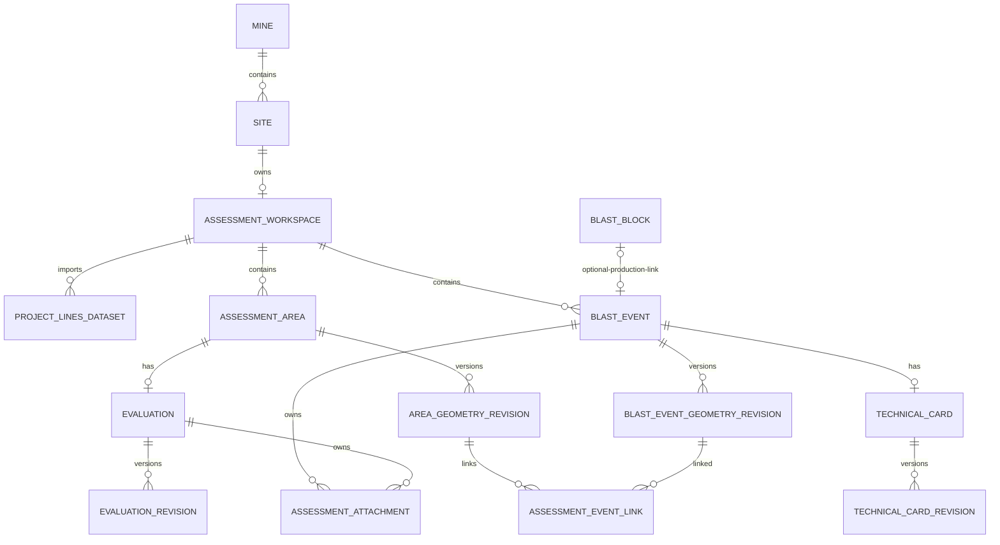

# Схема базы данных 2D Assessment

## Границы архитектуры

Иерархия данных — **Mine → Site (геотехнический Domain) → AssessmentWorkspace**. Название
`Site` и таблица `sites` пока сохранены: их переименование затронуло бы старый рабочий процесс
BlastBlock и не относится к закладке новой схемы. Ограничение `assessment_workspaces.site_id`
позволяет создать не более одного рабочего пространства для Site, но миграция не создаёт его
автоматически.

## Идентификаторы и таблицы

Все сущности имеют целочисленный суррогатный ключ `id`. Исходный строковый идентификатор
JSON без изменения хранится в `domain_id`: у верхнеуровневых сущностей он уникален внутри
workspace, у ревизий — внутри родителя. Для технических карт выбрана более строгая глобальная
уникальность `domain_id`; связь «карта → событие → workspace» всё равно однозначно определяет
владельца. Это оставляет будущему импортёру возможность точно сохранить `D-001` и прочие ID.

Новые таблицы:

- `assessment_workspaces` — владелец данных одного Site;
- `project_lines_datasets` — наборы исходных линий;
- `blast_events`, `blast_event_geometry_revisions` — события и версии геометрии;
- `blast_event_technical_cards`, `blast_event_technical_card_revisions` — карточки и версии;
- `assessment_areas`, `assessment_area_geometry_revisions` — области и версии геометрии;
- `assessment_event_links` — связь точных версий геометрии области и события;
- `assessment_area_evaluations`, `assessment_area_evaluation_revisions` — оценки и версии;
- `assessment_entity_attachments` — вложения событий и оценок.

У каждой версии положительный номер, уникальные внутри родителя номер и `domain_id`. Частичный
уникальный индекс разрешает лишь одну строку `is_active = true` у каждого родителя. Аналогичное
правило действует для активного набора линий в workspace. Поэтому обратная сборка JSON получает
активный domain ID без циклических внешних ключей.

## JSONB и геометрия

`JSONB` хранит полные снимки существующих объектов: линии Datamine, плановую геометрию,
срезы горизонтов, техническую карточку и оценку. Часто фильтруемые значения (статус, тип,
индексы, номера и ссылки на геометрические ревизии) остаются отдельными колонками. Такая схема
сохраняет все миграционно-совместимые поля, не дробя пока буровые группы и срезы на таблицы.
PostGIS отложен: текущие алгоритмы работают с сериализованными объектами, а пространственные
SQL-запросы и подтверждённые требования к CRS ещё не определены.

## Связи со старой системой и вложения

`blast_events.blast_block_id` необязателен, уникален и допустим только для production-события;
при удалении BlastBlock ссылка становится `NULL`. Contour-событию BlastBlock не нужен. Миграция
не меняет и не связывает существующие блоки.

Новая таблица вложений не затрагивает старую `attachments`. Проверка требует ровно одного
владельца: `blast_event` либо `assessment_evaluation`. Файлы и каталоги
`files/blast_events/<domain_id>/` и `files/assessments/<domain_id>/` не перемещаются и не
проверяются этой миграцией.

## Что остаётся без изменений

UI продолжает использовать рабочее JSON-хранилище: этот этап добавляет только схему и ORM.
Нет репозиториев, переноса данных, изменения ProjectTree или геометрических алгоритмов.
Следующие отдельные этапы:

1. репозитории;
2. транзакционный импортёр JSON;
3. переключение backend рабочего пространства;
4. окончательный ProjectTree.
